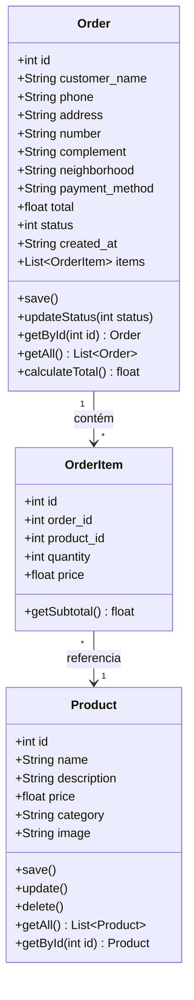
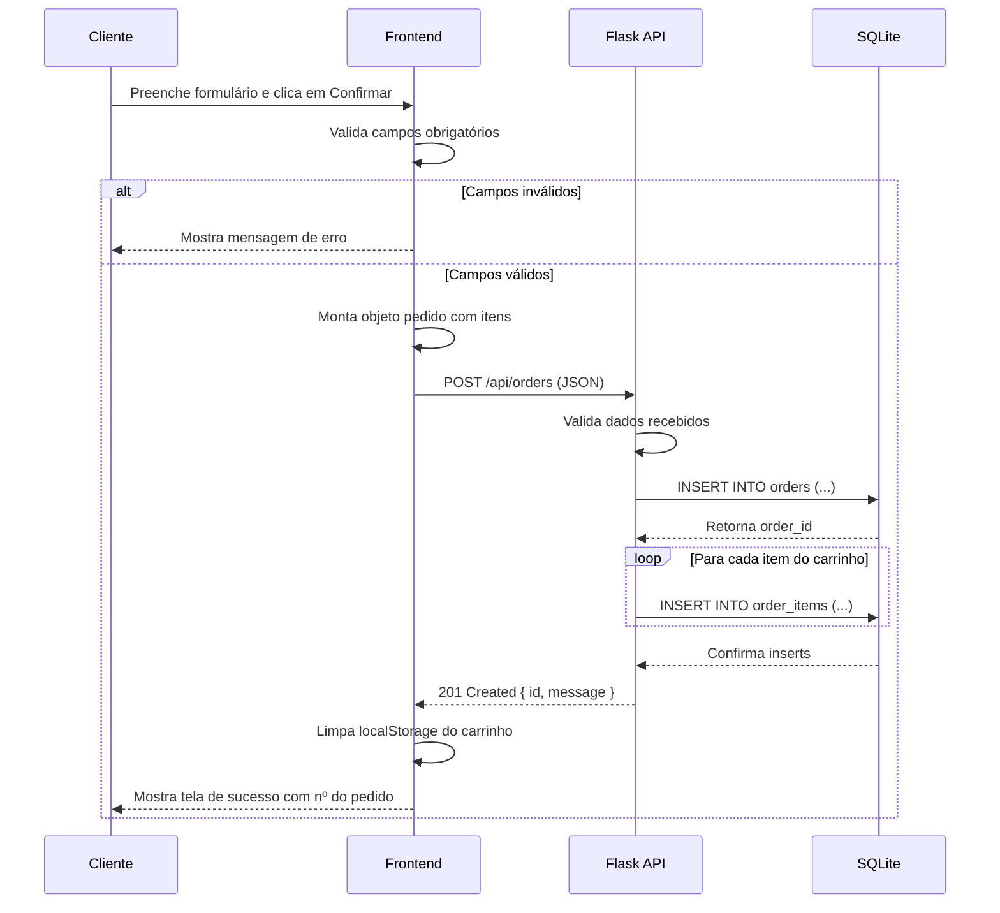

# UML - Cupcake Gourmet

## 1. Diagrama de Casos de Uso

```mermaid
usecaseDiagram
    actor Cliente
    actor Administrador

    package SistemaCupcakeGourmet {
        usecase "Visualizar Produtos" as UC1
        usecase "Adicionar ao Carrinho" as UC2
        usecase "Alterar Quantidade" as UC3
        usecase "Remover Produto" as UC4
        usecase "Ver Total do Pedido" as UC5
        usecase "Realizar Pedido" as UC6
        usecase "Consultar Status do Pedido" as UC7
        
        usecase "Cadastrar Produto" as UC8
        usecase "Editar Produto" as UC9
        usecase "Excluir Produto" as UC10
        usecase "Visualizar Pedidos" as UC11
        usecase "Alterar Status do Pedido" as UC12
    }

    Cliente --> UC1
    Cliente --> UC2
    Cliente --> UC3
    Cliente --> UC4
    Cliente --> UC5
    Cliente --> UC6
    Cliente --> UC7

    Administrador --> UC8
    Administrador --> UC9
    Administrador --> UC10
    Administrador --> UC11
    Administrador --> UC12
```

### Descrição dos Atores

| Ator | Descrição |
|------|-----------|
| **Cliente** | Usuário final que navega, compra e consulta pedidos. Representa qualquer pessoa acessando a parte pública do site. |
| **Administrador** | Responsável pela loja. Gerencia o catálogo de produtos e acompanha/atualiza o andamento dos pedidos. |

### Descrição dos Casos de Uso

#### Casos do Cliente
1. **Visualizar Produtos:** Acessa a página de produtos e visualiza cards com imagem, nome, descrição, categoria e preço.
2. **Adicionar ao Carrinho:** Clica em "Adicionar" e o produto é armazenado no localStorage.
3. **Alterar Quantidade:** Usa botões +/- para ajustar quantidades no carrinho.
4. **Remover Produto:** Exclui um item específico do carrinho.
5. **Ver Total do Pedido:** Visualiza subtotal e total geral atualizados em tempo real.
6. **Realizar Pedido:** Preenche formulário com dados pessoais e de entrega, confirma o pedido (salvo no banco).
7. **Consultar Status do Pedido:** Informa o número do pedido e visualiza dados e status (do 1 ao 4).

#### Casos do Administrador
8. **Cadastrar Produto:** Insere novo cupcake com nome, descrição, preço, categoria e imagem.
9. **Editar Produto:** Modifica dados de um produto existente.
10. **Excluir Produto:** Remove um produto do catálogo.
11. **Visualizar Pedidos:** Lista todos os pedidos da loja com resumo.
12. **Alterar Status do Pedido:** Atualiza o progresso do pedido entre os 4 status possíveis.

---

## 2. Diagrama de Classes



### Descrição das Classes

| Classe | Atributos Principais | Responsabilidade |
|--------|----------------------|------------------|
| **Product** | id, name, description, price, category, image | Representa cada cupcake no catálogo. Armazena dados de exibição e preço. |
| **Order** | id, customer_name, phone, address..., total, status, items | Representa um pedido completo. Agrupa itens, dados do cliente e status de entrega. |
| **OrderItem** | id, order_id, product_id, quantity, price | Item individual do pedido, com quantidade e preço unitário (snapshot do preço no momento da compra). |

### Relacionamentos
- **Order 1 --- * OrderItem:** Um pedido contém um ou mais itens de pedido (composição).
- **OrderItem * --- 1 Product:** Cada item referencia um produto do catálogo (associação).

---

## 3. Diagrama de Sequência (Simplificado) - Finalizar Pedido


