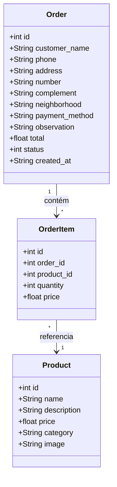

# UML - Cupcake Gourmet

## 1. Diagrama de Casos de Uso

Mostra as interações dos dois tipos de usuário com o sistema.

```mermaid
usecaseDiagram
    actor Cliente
    actor Administrador

    usecase "Visualizar Produtos" as UC1
    usecase "Buscar Produtos" as UC1b
    usecase "Adicionar ao Carrinho" as UC2
    usecase "Alterar Quantidade" as UC3
    usecase "Remover Produto" as UC4
    usecase "Realizar Pedido" as UC5
    usecase "Consultar Status do Pedido" as UC6

    usecase "Cadastrar Produto" as UC7
    usecase "Editar Produto" as UC8
    usecase "Excluir Produto" as UC9
    usecase "Visualizar Pedidos" as UC10
    usecase "Alterar Status do Pedido" as UC11

    Cliente --> UC1
    Cliente --> UC1b
    Cliente --> UC2
    Cliente --> UC3
    Cliente --> UC4
    Cliente --> UC5
    Cliente --> UC6

    Administrador --> UC7
    Administrador --> UC8
    Administrador --> UC9
    Administrador --> UC10
    Administrador --> UC11
```

### Explicação

- **Cliente:** Pessoa acessando a parte pública do site (comprar e consultar pedidos).
- **Administrador:** Pessoa responsável por gerenciar o catálogo e os pedidos.
- **Buscar Produtos:** Filtro simples por nome, aplicado diretamente na tela do catálogo.

---

## 2. Diagrama de Classes

Representa as 3 entidades principais do sistema e como elas se relacionam.



### Explicação

| Classe | Descrição |
|--------|-----------|
| **Product** | Representa cada cupcake do catálogo, com nome, descrição, preço, categoria e imagem. |
| **Order** | Representa o pedido finalizado, com dados do cliente, pagamento, observação, total e status. |
| **OrderItem** | Cada item dentro de um pedido (quantos de cada produto foram comprados e o preço na hora). |

**Relacionamentos:**
- 1 pedido pode ter *muitos* itens (`Order 1 -- * OrderItem`).
- Cada item referencia *1* produto do catálogo (`OrderItem * -- 1 Product`).
