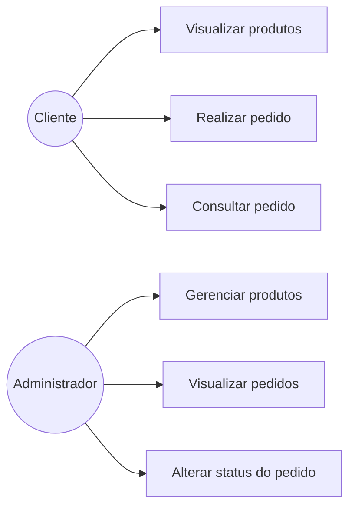
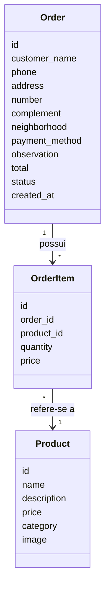

# UML - Cupcake Gourmet

Este documento apresenta os principais diagramas UML utilizados no projeto para representar as funcionalidades do sistema e a estrutura básica dos dados.

## 1. Diagrama de Caso de Uso

O diagrama mostra as principais ações que podem ser realizadas pelo cliente e pelo administrador.

### Explicação

**Cliente**

O cliente pode visualizar os produtos disponíveis, realizar um pedido e consultar o andamento do pedido.

**Administrador**

O administrador pode gerenciar os produtos cadastrados, visualizar os pedidos realizados e alterar o status dos pedidos.

A opção de realizar pedido inclui as etapas de adicionar produtos ao carrinho, alterar quantidades, remover produtos e informar os dados da compra.

---

## 2. Diagrama de Classes

O diagrama apresenta as principais classes utilizadas para representar os produtos e pedidos do sistema.

### Explicação das classes

| Classe        | Descrição                                           |
| ------------- | --------------------------------------------------- |
| **Product**   | Representa os cupcakes disponíveis para venda.      |
| **Order**     | Representa um pedido realizado pelo cliente.        |
| **OrderItem** | Representa cada produto que faz parte de um pedido. |

### Relacionamentos

* Um **Order** pode possuir vários **OrderItem**.
* Cada **OrderItem** está relacionado a um **Product**.
* Um produto pode aparecer em vários itens de pedidos diferentes.

## 3. Relação com o banco de dados

A modelagem foi feita de forma simples e está relacionada às tabelas utilizadas no banco SQLite:

* `Product` → `products`
* `Order` → `orders`
* `OrderItem` → `order_items`

Essa estrutura permite registrar os produtos da loja e os pedidos realizados pelos clientes.

## 4. Considerações

Os diagramas foram elaborados de acordo com as principais funcionalidades implementadas no sistema. A modelagem foi mantida simples para facilitar o desenvolvimento e a compreensão do projeto.

